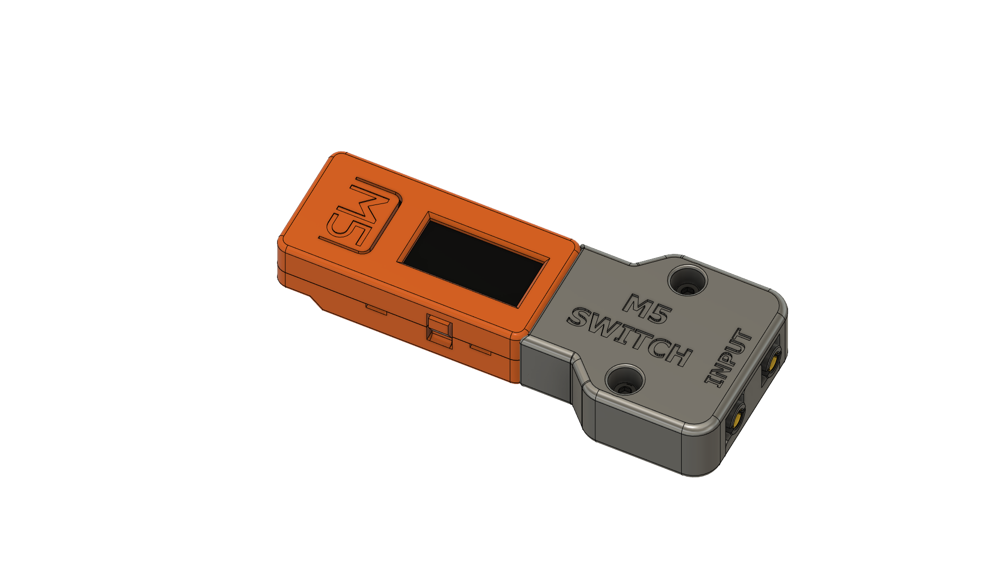

# M5-Access-Switch-Input

A Bluetooth enabled Adaptive Switch Interface based on ESP32 M5StickC/M5StickCPlus and the Switch Input module which offers up to two 3.5mm switch inputs. 

The Adaptive Switch Interface includes 4 operating modes: 

    1. Switch Mode
    2. Switch Mac Mode  
    3. Morse Keyboard Mode 
    4. Media Control Mode
    5. Settings Mode
	
The mode can be changed by pressing and holding Switch A for 4 seconds or pressing M5 button.

## Requirements and setup instructions 
The setup process is divided to three main catagories:

  1. [Hardware](./Hardware/) : The required hardware and design files
  2. [Software](./Software/) : The required software
  3. [Documentation](./Documentation/) : The assembly guide,user guide and other documents 

## License

### MIT License

Copyright (c) 2022 milador

Permission is hereby granted, free of charge, to any person obtaining a copy of this software and associated documentation files (the "Software"), to deal in the Software without restriction, including without limitation the rights to use, copy, modify, merge, publish, distribute, sublicense, and/or sell copies of the Software, and to permit persons to whom the Software is furnished to do so, subject to the following conditions:

The above copyright notice and this permission notice shall be included in all copies or substantial portions of the Software.

THE SOFTWARE IS PROVIDED "AS IS", WITHOUT WARRANTY OF ANY KIND, EXPRESS OR IMPLIED, INCLUDING BUT NOT LIMITED TO THE WARRANTIES OF MERCHANTABILITY, FITNESS FOR A PARTICULAR PURPOSE AND NONINFRINGEMENT. IN NO EVENT SHALL THE AUTHORS OR COPYRIGHT HOLDERS BE LIABLE FOR ANY CLAIM, DAMAGES OR OTHER LIABILITY, WHETHER IN AN ACTION OF CONTRACT, TORT OR OTHERWISE, ARISING FROM, OUT OF OR IN CONNECTION WITH THE SOFTWARE OR THE USE OR OTHER DEALINGS IN THE SOFTWARE.

